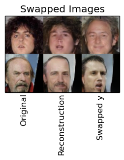
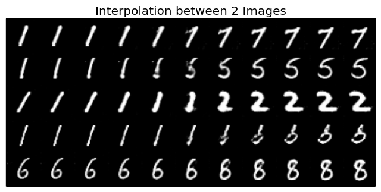

# GANs in Theano + Lasagne

## Introduction

The goal of this repo is to implement several different Generative Adversarial Networks in Theano + Lasagne. So far, we support:

* [Invertible Conditional GANs for Image Editing](https://arxiv.org/abs/1611.06355) from November 2016. 
* (WIP) [Boundary Equillibrium Generative Adversarial Networks](https://arxiv.org/abs/1703.10717) from 2017.

Our IcGAN implementation is based off of the author's Torch [implementation](https://github.com/Guim3/IcGAN), and the Lasagne DCGAN [Gist](https://gist.github.com/f0k/738fa2eedd9666b78404ed1751336f56) and MNIST [demo](https://github.com/Lasagne/Lasagne/blob/master/examples/mnist.py).

Our BEGAN implementation is based off the paper, as well as the sources above.

## Prerequisites

This was developed using:

* [Theano 0.9.0rc4](https://github.com/Theano/Theano)
* [Lasagne 0.2dev](https://github.com/Lasagne/Lasagne)
* [Scipy 0.13](https://www.scipy.org)
* [Matplotlib 1.3.1](https://github.com/matplotlib/matplotlib)
* [Numpy v1.13](https://github.com/numpy/numpy)
* (OPTIONAL) [Tabulate](https://pypi.python.org/pypi/tabulate) - This module can be used to display a list containing input, output dimensions of each layer of the GAN. 

Compatibility with other version modules is not guaranteed, especially Lasagne < 0.2.

## 1. Training the Model

Our implementation of ICGAN is trained in two steps.
1. Train the Generator + Discriminator
2. Train Encoder Z + Y, using minibatches of generated images from the trained generator

This is in contrast with the author's implementation that generates a single set of images to train on. Our implementation is also based around hardware constraints, so images are loaded in per minibatch into memory. Thus our implementation can be run on modest hardware though training may take more time.

On a NVIDIA GTX 1060 6GB GPU, the GAN models took about 15 minutes per epoch to train. The encoders took about 4-5 minutes per epoch to train. 

Our implementation of BEGAN is trained by alternating the generator with the discriminator.

### 1.1 Datasets supported

Currently, we support:

Dataset | Number of Images | Attributes|
--- | --- | --- |
[CelebA](http://mmlab.ie.cuhk.edu.hk/projects/CelebA.html) | ~200000 | 18 attributes from Perarnau et al. |
[MNIST](http://yann.lecun.com/exdb/mnist/) | 60000 | number written |

We recommend using the aligned and cropped datasets, though in theory any dataset can be used. 

We supply a set of results for IcGAN trained on CelebA. These models were generated using the rates and batch sizes given by the author (0.0002 and 64 respectively)

(WIP) We will soon supply a set of pretrained models + images of results from each epoch for BEGAN.

**Using the training function**

1. Download CelebA aligned + cropped images, along with the files `list_attr_celeba.txt` and `list_eval_partition.txt` [here](http://mmlab.ie.cuhk.edu.hk/projects/CelebA.html). 
2. You will then need to edit `config.py` with:
  + which model you would like to train - `'icgan'` or `'began'`
  + which directory to load images from
  + which directory to save generated images + models to
  + which dataset you would like to use - `['mnist']` or `['celeba']`
  + hyperparameters to use (learning rates, batch sizes, etc)
 See comments on `config.py` for more information.
3. 
``` 
	python main.py TRAIN_OR_TEST
```

* `TRAIN_OR_TEST` - whether to train a model, or test it using predefined functions. Note that if trained models do not exist in folder specified by `config.py`, this will result in an error.

## 2. Testing the Model

Currently, the test for IcGAN will generate an interpolation, a swap, and a reconstruction image and save them in `folder_name/images`. The test for BEGAN (WIP) will simply generate example images.

1.
``` 
	python main.py test
```

To use the pretrained models, edit `config.py` to have the variable `folder_name` point to `icgan_celeba`.

## ICGAN Results

These results are from the pretrained models provided, trained according to default specifications. These models were trained on the CelebA dataset with the 18 attributes from Perarnau et al. 

#### Reconstructions of Real Faces with Different Attributes on CelebA


#### Swapped Attributes on CelebA



#### Interpolation on CelebA


#### Reconstructions of Real Images with Different Attributes on MNIST


#### Swapped Attributes on MNIST


#### Interpolation on MNIST



## BEGAN Results (to Come)

These examples are from pretrained models provided, trained according to default specifications.

### Adding new models to this repo

One of the motivating factors behind combining implementations of several models into the same repo is that, because many functions provided in the repo are standard, it is very easy to implement and test new GANs.

To create a new model - one needs to provide three functions
* a function to make the training functions (generator trainer, discriminator trainer, generator) - referred to as `make_train_fns`
* a function to train the model - `train_{MODEL_NAME}.py`
* a function to test the model - `test_{MODEL_NAME}.py`
* any needed auxilary functions + graphical functions

To add a new dataset - one needs to provide a single file containing
* a method to initialize the dataset - usually providing filenames for images, and labels if necessary
* a method to load image files and preprocess them

Modifying `config.py` will also be necessary to supply image sizes, the number of color channels, etc.

Batch iterators, and many methods to display example images are provided in the repo. 

### To-Do

This repo is still a work in progress. Tasks to come include:
* Providing pretrained models for BEGAN (and possibly IcGAN on MNIST)
* Adding examples to `README`
* Providing a test function for `began`
* Rewriting `train` and `test` functions to use variables from dict more easily
* Adding additional tests to `config.py` to ensure invalid configs are not entered
* Increasing the number of datasets available to be loaded + models available
