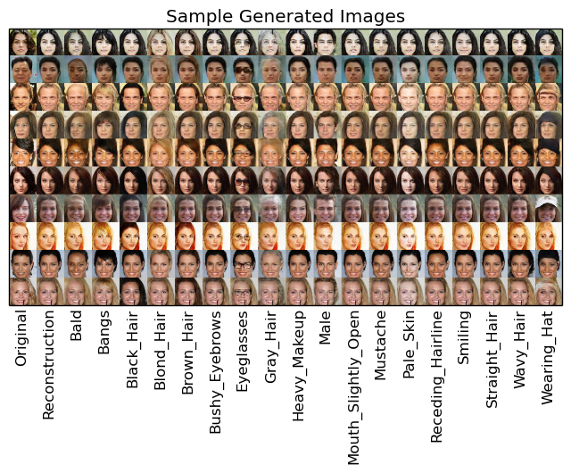
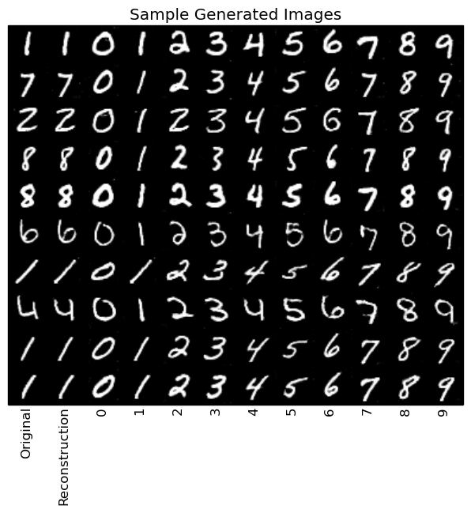

# GANs in Theano + Lasagne

## Introduction

This Repo is designed around several goals:
* Implement the models from different Generative Adversarial Network papers as faithfully to the original paper as possible,
but with the option of running the models on more modest hardware.
* Provide a standard format which is used to implement models for increased readability + usability
* Provide documentation for each function and class
* Write the implementations using a few key modules
* Provide test examples that show the performance of our implementations, not simply copying figures from the paper

## Documentation

We strive to provide high-quality documentation for each implementation. Documentation can be accessed at:

## Models Supported

So far, we support:

* [Invertible Conditional GANs for Image Editing](https://arxiv.org/abs/1611.06355) from November 2016. 
* [Boundary Equillibrium Generative Adversarial Networks](https://arxiv.org/abs/1703.10717) from March 2017.

## Prerequisites

The implementations were developed using developed using:

* [Theano 0.9.0rc4](https://github.com/Theano/Theano)
* [Lasagne 0.2dev](https://github.com/Lasagne/Lasagne)
* [Scipy 0.13](https://www.scipy.org)
* [Matplotlib 1.3.1](https://github.com/matplotlib/matplotlib)
* [Numpy v1.13](https://github.com/numpy/numpy)
* (OPTIONAL) [Tabulate](https://pypi.python.org/pypi/tabulate) - This module can be used to display a list containing
input, output dimensions of each layer of the GAN.

Compatibility with other version modules is not guaranteed, especially Lasagne < 0.2.

### Datasets Supported

Currently, we support:

Dataset | Number of Images | Attributes|
--- | --- | --- |
[CelebA](http://mmlab.ie.cuhk.edu.hk/projects/CelebA.html) | ~200000 | 18 attributes from Perarnau et al. |
[MNIST](http://yann.lecun.com/exdb/mnist/) | 60000 | number written |

We recommend using the aligned and cropped datasets, though in theory any dataset can be used.

### Training / testing a model

#### The Easy Way:
``` 
	python main.py TRAIN_OR_TEST IM_DIR FOLDER_NAME DATASET MODEL
```

* `TRAIN_OR_TEST` - whether to train a model, or test it using predefined functions.
Note that if trained models do not exist in folder specified by `config.py`,  and mode ``'test'` is selected,
this will result in an error.
* `IM_DIR` - where to read images from. Must be an absolute directory path, e.g. `/home/user/pic_dir`
* `FOLDER_NAME` - Name of folder to store created models in. Default is `test`
* `DATASET` - which dataset to use ( `'mnist'` or `'celeba'`). Default is `'mnist'`
* `MODEL` - Which model to train or test. Default is `'began'`

#### The Hard Way:

If you want to, for example, change the image size or learning rate of a given model, you will need to use
this method.

Effectively, you will need to invoke 3 commands:
* Setting a folder to save models in, setting folder to read images from
* Initializing the dataset
* Initializing the model
* Running model using train / test functions

An example where we set the learning rate of IcGAN to 0.0001 would be:

```python
from src.datasets.celeba import CelebA
from src.models.icgan import IcGAN

# setting a folder to save models in
im_dir = '/home/user/pics_dir/'
folder_name = 'my_model'
kwargs = {'lr': 0.0001}

# Initializing the dataset
dataset = CelebA(im_dir)

# Initializing the model
model = IcGAN(dataset, folder_name, **kwargs)

# Training the model
model.train()

```

## Results

We supply results in our documentation. All models are trained according to default specifications unless otherwise
stated.

These results are from the pretrained models provided, trained according to default specifications. These models were trained on the CelebA dataset with the 18 attributes from Perarnau et al. 

#### Reconstructions of Real Faces with Different Attributes on CelebA



#### Swapped Attributes on CelebA


#### Interpolation on CelebA


#### Reconstructions of Real Images with Different Attributes on MNIST



#### Swapped Attributes on MNIST


#### Interpolation on MNIST


## BEGAN Results

These examples are from pretrained models provided, trained with no increase in filters, 64 filters and `gamma = 0.7` on CelebA

#### Interpolation on CelebA


#### Example Generations on CelebA


### To-Do

This repo is still a work in progress. Future work will focus on increasing the number of datasets available to be
loaded + models available
